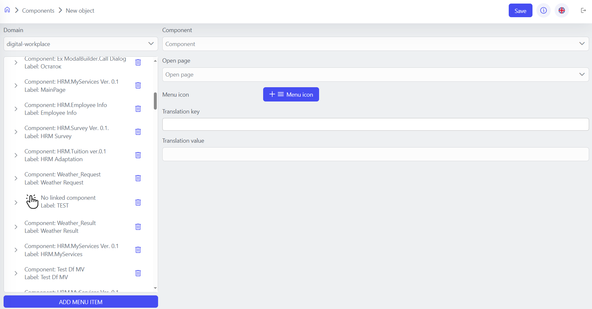

# Component

Components are the key building blocks in the platform, providing the basis for building applications. They are encapsulated units of functionality that can include data, user interface, business logic, and process automation.

## Component Types

1. **Single Component**:

   - Contains the basic object model for storing data.
   - Includes a UI model with forms and controls.
   - Has an automation model with dataflows and workflows.
   - Supports Python scripts for additional behavior customization.
   - It has unique security options.

2. **Multi-Component**:
   - Combines multiple Components to create complex applications.
   - It is used to build a single user interface, for example, in mobile applications.

## Creating a New Component

1. Open Studio ('https://<your-hosting-name>/studio').
2. Go to Applications/Components menu.
3. Click Add button to create a new component or multi-component.

## Basic Component Settings

| Parameter         | Description                                                          |
| ----------------- | -------------------------------------------------------------------- |
| `Title`           | The name of the component that is displayed to users.                |
| `Proxy Mode`      | Determines whether the component will act as a proxy.                |
| `Restrict Access` | Restricts access to the component.                                   |
| `Maker`           | Identifies the creator or owner of the component.                    |
| `Cron`            | Configuring the start time of a component using Cron.                |
| `Run as User`     | Specifies the user on whose behalf it will be executed.              |
| `Access Mode`     | Defines the mode of access to the component.                         |
| `Description`     | A detailed description of the component, its purpose, and functions. |
| `Domains`         | The domains or categories to which the component belongs.            |

## Component Object Model in the Platform

Each component in the platform automatically includes the following fields:

- 'Id': A unique component identifier.
- 'creatorSubject': The subject that has created the object.
- 'updateSubject': The subject that has updated the object.
- 'createdDate': Date when the object was created.
- 'updateDate': Date when the object was last updated.

Components can include additional elements, which can belong to one of eleven types: 'string', 'datetime', 'catalog', 'number', 'integer', 'array', 'file', 'boolean', 'time', 'date', 'uri'. Each of these elements has its own settings.

Global settings for all types:

- 'Name': System name of the property.
- 'Title': Name of the property to be displayed in the interface.
- 'Required': Specifies whether the field is required.
- 'Primary Key': Determines whether a field is a unique identifier.
- 'Query': Determines whether the field can be used in queries.
- 'Virtual property': Excludes a field from synchronization processes.

## Interface Builder

The platform offers a powerful tool for customizing the user interface for each component – the Interface Builder. It is a visual editor that allows you to create and customize multi-component user interfaces using drag-and-drop features. The Interface Builder is a workspace in the Definition section of the Component Creation Interface.

In this section, you can:

- Create a multi-screen app interface using an intuitive drag-and-drop editor.
- Add UI elements from the Basic, Advanced, and Layout categories.
- Configure the object model for the Workflow and Dataflow of the application.
- Customize CSS styles for all UI elements.

After you add UI elements to your app's page layout, you can do the following operations:

- **Copy:** Copies the current element to the clipboard.
- **Paste:** Pastes the copied item into a new location.
- **Move:** Changes the position of the element.
- **Properties:** Opens the properties panel to configure the element.
- **Preview:** Shows the layout in a format that is close to the user's application.
- **Markup Preview:** Displays the textual web markup of the page.
- **Delete:** Deletes the selected element.
- **Data Field:** Allows you to bind an element to a data field (database link).

## Web parts module: “Styles” and “JavaScript”

The “Styles” block is designed to describe the CSS styles that are applied to the component, while the “JavaScript” block allows you to establish interaction with the user interface and provide additional functionality using the JavaScript language.

In this way, the Web Parts module enables developers to create more complex and interactive components using different programming languages to describe styles and functionality.<br>

### Using "JavaScript"

Example of using JavaScript to implement functionality for creating buttons, pressing which takes a screenshot:

1. To call JavaScript functions from the 'Web parts' block, it is necessary to use the method context.InvokeInterop(methodName, objects) within Componen script:

````python
def capturePage1():
    context.InvokeInterop("callScreenshot")

2. Next, we move to the 'JavaScript' section of the 'Web parts' block and prepare function:
```javascript
// Creating a <script> element to load the html2canvas library
var script = document.createElement('script');
script.src = "https://cdnjs.cloudflare.com/ajax/libs/html2canvas/1.4.1/html2canvas.min.js";
document.head.appendChild(script);

// Function to create and download a screenshot of the page
function takeScreenshot() {
    // Capturing a screenshot of the entire body using html2canvas
    html2canvas(document.body).then(canvas => {
        // Creating a link for downloading the screenshot
        var link = document.createElement('a');
        link.href = canvas.toDataURL("image/png");
        link.download = "screenshot.png";
        // Adding the link to the HTML document and simulating a click to download the screenshot
        document.body.appendChild(link);
        link.click();
        // Removing the link from the document after the screenshot has been downloaded
        document.body.removeChild(link);
    });
}

// Method to call the takeScreenshot function
this.callScreenshot = () => {
    takeScreenshot();
}

This code creates a script element that loads the library html2canvas from a Content Delivery Network (CDN). After loading the library, a function takeScreenshot() is defined, which captures a screenshot of the current page using html2canvas.

After creating the screenshot, the code creates an <a> element to make it possible to download, sets its href to the image URL in PNG format and download attribute to screenshot.png. Then it adds this link to the document body, emulates a click on this link to download the screenshot, and finally removes the link from the document.

### Using "Styles"

Example CSS code that sets the background color of your entire workspace

```css
body {
    background-color: violet; /* Purple background color */
}
```

## Dataflow and Workflow Building {: #dataflow-workflow }

The object model of each Component contains data that is used both within the Component itself and in the processes of its integration with other elements of the system. This data serves as the basis for configuring and executing dataflows and workflows.

To start building a Dataflow or Workflow, you need to drag one of the elements from the "Flows" to the interface builder area, after which you will be able to customize the visual editor of the dataflow and workflow.

Read more about [Dataflow components](data-flow-components/index.md) and [Workflow components](workflow-components/index.md)

## Publishing a Component and Transferring It to the Web Interface {: #publication }

- After you have finished configuring the component, you must publish it as part of a new publication.
- Managing publications is described in [Publishing Applications](publishing-applications.md).
- Next, you need to go back to the 'Home' menu and go to the 'Navigation menu' of the desired 'application domain', click 'Add menu item', select the desired component, fill in the parameters and click 'Save'.


