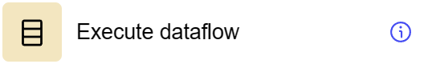

# Execute dataflow

## General information
The Execute Dataflow step is used to call Dataflow from any published component. This step allows you to run an additional Dataflow in the context of the current data processing process.

When used with an array field obtained from an external source or from an array field (property), the step parses this array and starts parallel processing of each record or object contained in the array.

## Parameters
**Step Settings:**

| Setting Field     | Value Options | Purpose |
|--------------------|-------------------|------------|
| Step name          | -                 | Name of the step |
| Source step        | -                 | Selecting the previous step |
| Component          | -                 | The component from which Dataflow is called |
| Dataflow           | -                 | Dataflow name to be executed |
| Result store field | -                 | Field for saving the Dataflow execution result |

## Cases
- **Updating data from other dataflows**: The “Execute Dataflow” step is ideal for situations where you want to update fields in the current model with data collected or processed in other dataflows. This makes it possible to effectively integrate and synchronize data between different processes and components.
- **External Dataflow call**: Used to integrate and launch additional Dataflows as part of the current data processing process.

## Exceptions
- **Dependency on the correctness of other dataflows**: The effectiveness of the “Execute Dataflow” step directly depends on the accuracy and reliability of data obtained from other dataflows. All related dataflows should be carefully configured and tested to ensure that the updated data is correct and up to date.

## Application scenario

This component creates a dataflow to perform operations on the data of the current component. It includes Get action model steps to retrieve the dataflow model and Execute dataflow steps to execute the dataflow with appropriate parameters such as selecting the current component, choosing the dataflow to execute, configuring result fields, and displaying definitions from the data component. This component allows data operations on the component directly from the application interface.

- You can download the component configuration [here](https://drive.google.com/file/d/1ekmRNTRgO30koKm04pyhEZsXG9W5T-O-/view?usp=sharing).

