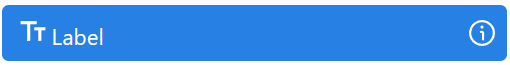

# Label

## General information
Label is a basic UI component designed to display non-editable text fields on screenshots. This component is widely used to add descriptive text, titles, or simply display information that the user cannot change.

## Parameters
**Component Properties:**

| Settings group | Setting Field   | Value Options         | Purpose |
|----------------|------------------|---------------------------|------------|
| (Global settings)        | Name             | -                         | Name of the UI Component in the system |
| Text           | Font size        | -                         | Size of the font |
|                | Color            | -                         | Text color (CSS) |
|                | Bold             | true, false               | Bold font |
|                | Italic           | true, false               | Italic font |
|                | Text alignment   | Left, Right, Center, Justify | Text alignment |
| Common         | Binding          | Multiselect of Catalog | Binding to Data |
|                | Value            | -                         | Static field value |
|                | Format           | -         | Data input/output format (For DataTime) |

**CSS Properties:**

| Settings group | Setting Field   | Value Options         | Purpose |
|----------------|------------------|---------------------------|------------|
| Layout         | Align items      | None, Center, End, Start, Stretch | Aligning elements in a flex container |
|                | Width            | -                         | Component width |
|                | Height           | -                         | Component height |
|                | Grow             | true, false               | Stretching a component in a container |
|                | Margin           | -                         | Outer padding |
|                | Padding          | -                         | Inner padding |
| Appearance     | CornerRadius     | -                         | Corner radius |
|                | BorderThickness  | -                         | Border thickness |
| Brush          | Background       | -                         | Background color |
|                | BorderBrush      | -                         | Border color |

## Cases
- **Information Tips**: Using a label to provide supporting information next to other UI elements, such as explaining the functions of buttons or input data.
- **Section Headings**: Labels can serve as headings for different sections of the interface, clearly delineating content to improve the user experience.
- **Status Display**: In cases where it is necessary to display the status or result of an operation, a label can be used to display the corresponding messages (for example, “Loading...”, “Successfully completed”).

## Exceptions
- **Non-Editability**: Label is not intended for user input or editing of text. Trying to use it for these purposes will result in ineffective interface design.
- **Format Restrictions**: While label allows a certain level of text customization, it cannot contain complex text elements such as hyperlinks or inline images.
