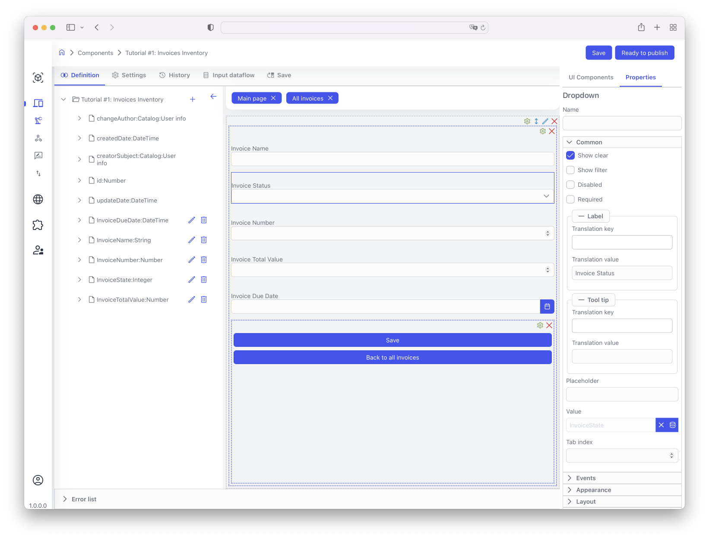
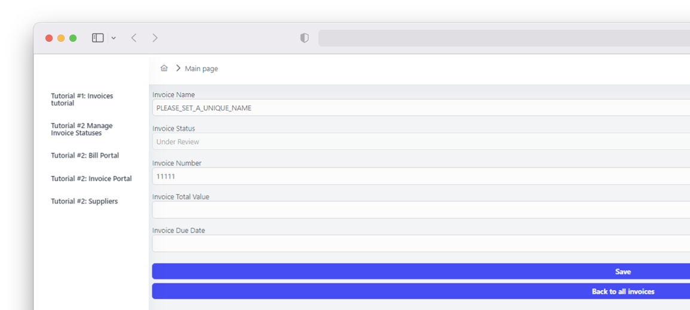

# Tutorial №3

<br>

## Using Python

### Introduction

<br>

The platform provides the ability to use Python for various purposes as a convenient and widely known scripting/programming language.

Python scripts supported by the platform must use Python version 3.0, as described here: https://docs.python.org/3/. The full developer guide can be found in the "Using Python" section.

The version of Python used by the platform is called Iron Python, which provides an interface to C# code. It provides two important libraries that need to be imported at the beginning of the script — `clr` and `system`. These libraries provide access to platform entities that can be queried and controlled from the script.
<br>

### Ways to Use Python Scripts on the Platform

<br>

There are several ways to use Python on the platform:

- It allows controlling application forms designed and executed using the platform, as well as providing custom indices that can be triggered in response to an event, such as a client pressing a button.
  <br>

- Calling a Function Inside a "Component Script", for Example, When a Button Is Pressed:

  - To do this, you need to define a function inside the Component Script, then go to a UI control element such as a Button, go to the "Actions" section and set the "Command Type" parameter to "Execute Script". Then you need to enter the name and call parameters (if any) of your script in the provided fields.
    <br>

- Using a Function Inside a Component Script for Value Change Events:
  - To do this, you need to define a function inside the component script, then go to a UI control element such as a text box, etc., then go to the "Events" section and enter the name of your script in the "On value change" field.
  - Note that this function will only be called if the data in the field has changed and the focus of the UI control element in the form leaves this UI control element.

<br>

- By Subscribing to Data Changes Using the `context.DataModel.Model.Subscribe()` Method:
  - The easiest way to do this is to define a function to intercept all changes (e.g., `def check_all_changes()`) in your component script, and then subscribe to it.
  - Your function will be called every time there is a change in the current data of the UI control element, at the moment when this UI control element loses focus (for example, when the user switches to another UI control element or another application).

<br>

- As part of a DataFlow action, execute a script to define decision-making logic, transform data, and set internal variables that will be used as part of DataFlow scripts. You can see examples of using Python scripts for DataFlow in the "Using Python" section.

<br>

### Using Python to Access Platform Components

<br>

To access platform components, you first need to import the clr libraries of IronPython, as shown below.

```
#Add IronPython library that imports system CRL (.NET) names into Python
import clr
```

After importing, several objects can be accessed from within the Python script via the system variable `context`.

<br>

### Using context.Model & context.DataModel

<br>

`context.Model` & `context.DataModel` provide access to various data fields of the platform model.

For context.Model, data fields include both the default component fields provided by the platform and custom fields added by the component developer.

For context.DataModel, only custom fields added by component developers are available.

It is recommended that context.DataModel be used to access all custom fields, and context.Model be used only to access the internal fields of the default component.

If we write a component script that accesses this model, the following system model variables will be available in our script through context.Model:

- `Id` - internal identifier, automatically generated by the platform for each component. If Id == 0, it means that the component data has not yet been saved, indicating that we are in the data entry mode for this particular instance of the component data, such as adding a new invoice in our Tutorial #1.
- `createDate` - internally set date when the data instance of this component was first created
- `name` (String) - system user-friendly name that will be taken by default to display links through Catalog type fields
- `updateDate` - internally set date of the last update of this component's data instance.
- `CreatorSubject` - data that shows which user added the data instance of this particular component.
- `changeAuthor` - data that shows which user last updated this particular component

Additionally, the following component-specific attributes will be available for our Tutorial #1 component via context.DataModel (recommended) or context.Model:

- `InvoiceName` - unique name for our new invoice
- `InvoiceState` - current status of our new invoice
- `InvoiceNumber` - unique number identifier for our invoice
- `InvoiceDueDate` - due date of our invoice
- `InvoiceTotalValue` - total value of our invoice

Let's now write a sample script that will pre-fill some fields for a new invoice.

<br>

```python
#Start of the script
#Add IronPython library that imports system CRL (.NET) names into Python
import clr

#Get Component’s DataModel reference
datamodel = context.DataModel.Model
# context.Model.Id shows internal Id for the component data instance
if (context.Model.Id == 0):
# If context.Model.Id is 0, then the instance has not yet been created,
# That means we are creating a new invoice
# We will then set some fields with default values
# Since this is a new Invoice,
# We’ll set it’s status to Under Review and provide default number and name
datamodel.InvoiceNumber = 11111
datamodel.InvoiceName = 'PLEASE_SET_A_UNIQUE_NAME'
datamodel.InvoiceState = 0
#End of the script
```

<br>

Now, if we open the Tutorial #1 application and click the "Add" button to add a new invoice, the screen will look like this:

<br>


<br>

### Using context.Properties

<br>

`context.Properties` allows access to all component elements and can be used, for example, to utilize form UI control element functions to manage a specific UI control element.

To access a UI control element, use `context.Properties` as follows:

```
context.Properties.<Internal_UI_Control_Name>.<UIControlProperty> = <Value>
```

Here, `<Internal_UI_Control_Name>` should be replaced with the name of your UI control element that you configured during design. For example, in the case of Tutorial #1, we set the internal name for the InvoiceState UI control element as shown below:

<br>



<br>

Now we can use this internal name to set the following logic:

1. When creating a new invoice, the status is set to "Under Review".
2. Changing the status field is prohibited, meaning this field should be disabled but visible.

The way to do this is to use the `Disable` property of our UI control element to set it to `True`. This will make the field appear but it cannot be changed by the user creating the new invoice. This is done by adding a line of code as shown below:

```
context.Properties.UI_InvoiceStatus.Disabled = True
```

Adding this to our component script will result in the following changes in our new invoice addition form.

<br>



<br>

As you can see, the "Invoice Status" field is now disabled.

Another frequently used `context.Properties` field for managing UI control elements is `Visible`. If set to `False`, this specific UI control element will not appear in the form. It can then be re-enabled by setting it to `True`. This can be done for any UI control element, including panels containing several different UI control elements.

An example of how it can be used in the context of our Tutorial #1 to initially hide the "Invoice Status" field is shown below.

<br>

```python
if (context.Model.Id == 0):
    context.Properties.UI_InvoiceStatus.Visible = False
if (context.Model.Id > 0):
    context.Properties.UI_InvoiceStatus.Visible = True
```

<br>

There is also the `Hidden` field, which hides/shows user interface elements, similar to the `Visible` field.

Another frequently used `context.Properties` field is `Required`. If set to `True`, the specific UI control element becomes mandatory (cannot be empty), and if set to `False`, it becomes optional. Note that this only changes the state of the UI control element for the custom property in the current form instance, not the custom property itself, the form template, or UI control elements for this custom property in other forms.

<br>

### Using context.Form

<br>

`context.Form` can be used to access form data (e.g., for validation purposes during form processing, before the form data is saved to internal storage) or to manage the visual representation of the form, such as by setting an error message.

To do this, use `context.Form.Get(<CustomFieldName>)` to get an object representing a specific field. Then you can use the following functions with this object.

- `context.Form.Get(<CustomFieldName>).SetValue(<Value>)` — sets the value for a specific UI control in the current form.
- `context.Form.Get(<CustomFieldName>).AddError(<StringValue>)` — sets an error message displayed under a specific UI control in the current form.
- `context.Form.Get(<CustomFieldName>).ClearError()` — clears the error message shown under a specific UI control in the current form.

The following script extension shows how to check the situation where the user did not change the default invoice name that we set above in the examples for Tutorial #1.

<br>

```python
if datamodel.InvoiceName == 'PLEASE_SET_A_UNIQUE_NAME':
    context.Form.Get("InvoiceName").AddError("Please set a unique invoice name")
else:
    context.Form.Get("InvoiceName").ClearError()
```

<br>

The result will look like the following screenshot if the default name was not changed:

<br>


<br>

### Using context.Commands

<br>

`context.Commands` can be used to manage the UI of the currently executing component, change the content of the current form, open different pages, open new components, return to the previous page, or even launch new Workflows, Dataflows, or Scripts.

These commands are typically used within scripts called by the ExecuteScript action using buttons, and in similar cases. For example, in our Tutorial #1, the Back to All Invoices button can use the following script to return to the previous page:

<br>

```python
def navigate_back():
    context.Commands.NavigationBack()
```

<br>

This script should be part of the component script and be set up for the Back to All Invoices button, in the `Actions` section -> `Command Type`: `Execute Script` -> `Method Name`: `navigate back`.

<br>

Other available context.Commands functions:

- `context.Commands.AddItem(GUID)` - add a UI control element to the page using the GUID.
- `context.Commands.ChangePageAsync(GUID)` - open a page using its GUID
- `context.Commands.ChangePageByName(«PageName»)` - change the current component page to a new page using the internal name
- `context.Commands.OpenComponent(GUID ComponentID, GUID PageID)` - open a new component and a specific page within the component
- `context.Commands.EditItem(GUID UI_ControlID, EntityId)` - shift the UI focus to a specific UI control element and specific data (using its internal identifier)
- `context.Commands.ExecuteWorkflow(GUID WorkflowID)` - execute a workflow using its identifier. Additionally, you can set WaitComplete to true or false if needed.
- `context.Commands.ExecuteDataflow(GUID dataflow identifier, ContextID)` - execute a dataflow using its GUID and the specified data context.
- `context.Commands.ExecuteScript(String ScriptName, StringParams Script)` - execute a script (function) from the Component Script with some parameters.
