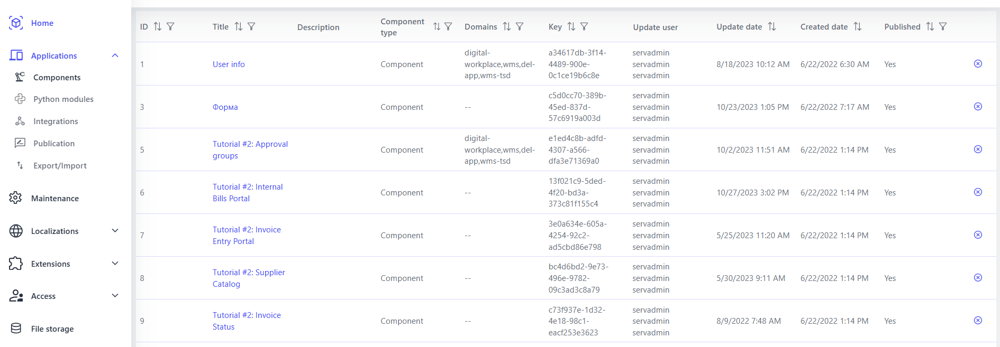
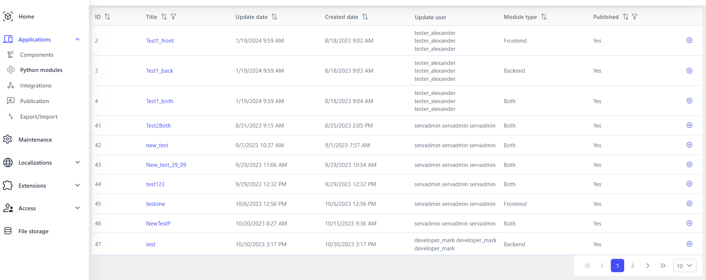

# Applications Menu

 

## Components

This section contains a complete list of all components available in the system. From here, you can view the details of each component, as well as add new components or multi-components, expanding the capabilities of your application. Ideal for organizing and managing all the components of your project.

 

## Python Modules {: #python-modules }

This section offers the ability to add and manage common Python modules. These modules become available both on the front-end in Component Script and on the back-end in Execute Script for dataflow. This allows you to centrally manage the logic that can be used in different parts of the application. Read more here: [Using Python](../app-development/using-python.md)

 

## Integrations

The “Integrations” section plays a key role in creating links between your application and external services. Here you can add new integrations, remove unnecessary ones, and change the settings of current integrations, which provides flexibility and scalability of the application functionality.

 

## Publication

Once you’ve finished configuring and preparing your components, this section allows you to publish them for future use. You can choose components, localizations, integrations, and even Python modules to include in your publication, making the deployment process efficient and organized. Read more here: [Publish Components](#publication)

 

## Export/Import

This section provides tools for exporting and importing component configurations in JSON format. This is useful for moving settings between different environments, such as from development to testing or production, making it easier to migrate and synchronize changes between different Studio instances.

