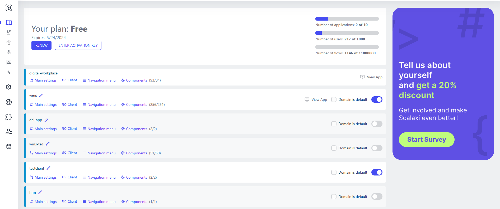

# Home Menu

<br>

The page provides information about your license and the application domains that have been deployed. You’ll get access to the following features and information:

- **Plan Type**: This displays the type of your current plan and the expiration or renewal date of your subscription.
- **Application Domains**: This section allows you to create application components, connect users via specific URLs, and navigate to the “Navigation Menu” section.
- **Usage Statistics**: Displays information about the current number of applications compared to the total limit, as well as the current and total number of users, workflows, and dataflows.
  <br>


<br>

## Learn more about configuring applications domains

Application domains are external spaces with a specific URL (HTTP/HTTPS://<your-domain-name>) where you can deploy your components.

**By default, an app is available** named ‘digital-workplace’. You can add more apps using the ‘Add application’ button in the upper right corner of the toolbar. Each app you add appears in the list of apps under your plan description.

In the application domain, the following parameters can be set in the ‘main settings’:

| Settings group | Setting Field         | Value Options                                     | Purpose                                                 |
| -------------- | --------------------- | ------------------------------------------------- | ------------------------------------------------------- |
| Main settings  | Title                 | -                                                 | Browser Tab Title                                       |
|                | Hide top bar          | true, false                                       | Hiding the top menu for workplace                       |
|                | Static menu           | true, false                                       | Constant display of menus or display on mouse hover     |
|                | Hide breadcrumps      | true, false                                       | Showing/hiding hierarchical navigation                  |
|                | Hide user login       | true, false                                       | Showing/hiding user login                               |
|                | Hide locale           | true, false                                       | Showing/hiding location selection                       |
|                | Choose logo           | Logo, Small logo, favicon, "No image" placeholder | Choosing a logo for WorkPlace (different types)         |
|                | User Session Storage  | local/session                                     | Saving authorization parameters in a session or locally |
|                | Default Idp provider  | Multiselect of Catalog                            | Choosing an Authorization Method                        |
|                | Default locale        | Multiselect of Catalog                            | Default localization                                    |
|                | Default user info app | Multiselect of Catalog                            | Main application for managing user data                 |
|                | Default component     | Multiselect of Catalog                            | Default Component                                       |
|                | Default page          | -                                                 | Default component page                                  |
|                | Login component       | Multiselect of Catalog                            | Authorization form component                            |
|                | Enable SIP            | True, False                                       | Building integration with SIP                           |

<br>

In this group, you can set the settings of global modules via JavaScript and CSS, which allows you to turn the platform into a content management system (CMS), as well as upload and use any third-party libraries.

JS example for global JavaScript:

```javascript
loadScript([
  'https://code.jquery.com/jquery-3.7.1.min.js?integrity="sha256-/JqT3SQfawRcv/BIHPThkBvs0OEvtFFmqPF/lYI/Cxo=&crossorigin="anonymous"',
])
  .then((res) => {
    return loadScript([
      'https://code.jquery.com/ui/1.13.2/jquery-ui.min.js?integrity="sha256-lSjKY0/srUM9BE3dPm+c4fBo1dky2v27Gdjm2uoZaL0="&crossorigin="anonymous"',
    ]);
  })
  .subcribe({
    complete: () => {
      console.log("Load scripts complete");
    },
    error: (err) => {
      console.log("Load scripts err:" + err);
    },
  });
```

<br>

In addition, there is a ‘style settings’ group of settings:

| Settings group | Setting Field        | Purpose              |
| -------------- | -------------------- | -------------------- |
| Main font      | Font                 | Main font of the app |
| Color scheme   | Default theme        | Default color scheme |
|                | Primary light color  | Main light color     |
|                | Primary color        | Main color           |
|                | Primary dark color   | Main dark color      |
|                | Primary darker color | Main darker color    |
|                | Primary text color   | Default text color   |

<br>

‘Edit manifest’ settings group:

| Setting Field         | Purpose                         |
| --------------------- | ------------------------------- |
| Name                  | Name of the app in the manifest |
| Short name            | Short name of the app           |
| Choose Icon (192x192) | Choosing a 192x192px app icon   |
| Choose Icon (512x512) | Choosing a 512x512px app icon   |

<br>

## SIP Integration

If the ‘Enbale SIP’ option inside the ‘Main settings’ is enabled, several subsequent settings are required for calls from the work-place to work correctly.

**On the studio side:**

| Setting Field        | Purpose                                                               |
| -------------------- | --------------------------------------------------------------------- |
| SIP WebSocket server | SIP WebSocket server address (e.g. 'wss://test-pbx.aqtra.ru:8089/ws') |
| SIP realm            | SIP Scope (realm)                                                     |

<br>

**On the work-place side:**

| Setting Field        | Purpose                                                               |
| -------------------- | --------------------------------------------------------------------- |
| SIP user name        | Name of the SIP user                                                  |
| SIP user password    | Password of the SIP user                                              |
| SIP WebSocket server | SIP WebSocket server address (e.g. 'wss://test-pbx.aqtra.ru:8089/ws') |
| SIP realm            | SIP Scope (realm)                                                     |

<br>

If all parameters are set correctly, you will be able to make calls from the work-place. You can read about working with SIP within the component script here: [Using Python](../app-development/using-python.md).
