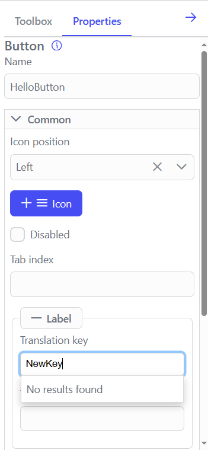
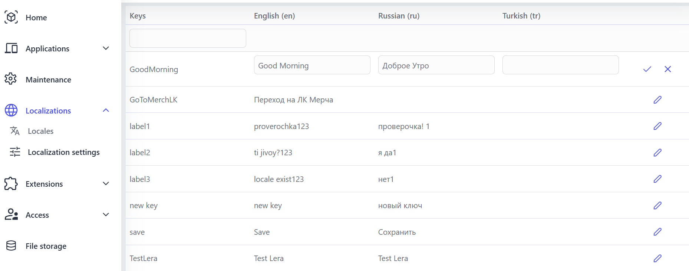

# Localizations Menu

 

The platform provides extensive capabilities for creating multilingual user interfaces, making it easier to develop applications that support a global audience. At the moment, the platform supports multiple languages, including English, Turkish, and Russian. This is achieved via the use of a localization system and translation keys, which allows the user interface to be dynamically adapted to different language standards. These features provide flexibility and scalability for multilingual application development, making it ideal for implementing complex international projects.
 

## Configuring the translation key for the UI Component

- When adding UI elements to a component, you can configure a ‘Translation Key’ instead of a static label.
- Example: The “Save” button can have a translation key instead of the hard-coded “Save” text.
- If the translation key is new, enter its name and add it as a new key.
- If the key already exists, select it from the drop-down list.
- Here’s an example of using a new key:

 

- An example of using an existing key:

 

## Providing Translation Values for Translation Keys

1. Open ‘Studio→Localizations→Localization Settings’.
2. Select the key you want to edit and click on the pencil.
3. Make changes to the localization values for the languages you want.
4. Confirm the changes.

- Editing example:

