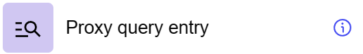

# Proxy query entry

## General information
The “Proxy Query Entry” step is used to generate a proxy query model using a filter (**Query**) to retrieve single or multiple entries. This step works in conjunction with the “Proxy mode” setting in the “Settings” section. In order for the component data model to work correctly, properties with the **Query** flag must be defined.

## Parameters
**Step Settings:**

| Setting Field        | Value Options | Purpose |
|-----------------------|-------------------|------------|
| Step name             | -                 | Name of the step |
| Query Filter          | -                 | Filter to define a specific entry for a query |
| Proxy mode settings   | -                 | Reference to proxy mode settings defined in “Settings” |

## Cases
- **Filtered Queries in Proxy**: Used in input dataflow for components marked as proxy to run queries with data filtering.
- **Retrieving Specific Data**: Retrieves a specific entry based on certain filter criteria.

## Exceptions
- **Component Configuration Dependency**: Requires certain properties with the **Query** flag in the component datamodel.
- **Limited Use**: The step is designed to retrieve data based on filters and is not suitable for general queries without specification.
