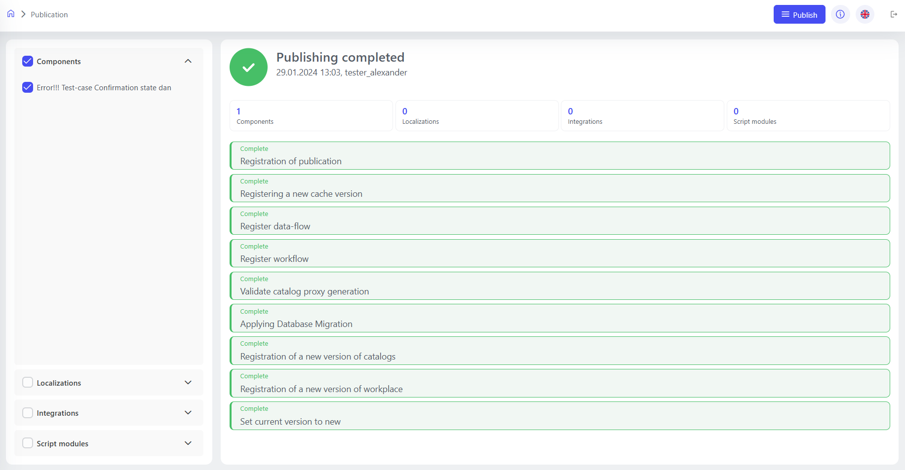

# Publications

To create a component version, localization, extension, or other appropriate customization via the platform, you must publish it. And in order for a component version to be published, it must be marked as ready to publish. 

The publishing process is controlled through the state machine, which allows you to effectively control all stages and, in case of errors, return the system to the previous state. A global lock feature has been introduced to prevent multiple publications from being started at the same time. Users see the status of active publications, and after each publication is completed, the statuses of the objects that are ready to be published are updated automatically.

**Steps to publish a component:**

- **“Save”** button: Used to save the current changes to the component.
- **“Ready to Publish”**: Marks a component as ready to publish after all changes have been saved.

**Steps for publishing localizations and integrations:**
- Automatically become available for publishing after you make changes.

**Publishing Process:**
1. **Go to Publications**: Located in ‘Studio→Applications→Publication.’
2. **Selecting Items to Publish**: 
   - Components, localizations, integrations, and Python modules are selected to be published.
3. **Final publication**: 
   - The procedure is completed by clicking the publish button.
   - A notification appears when the publication is successful.

