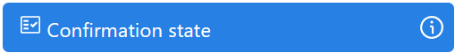

# Confirmation State

## General information
The “Confirmation State” is a UI component for displaying a preconfigured approval form used to manage the confirmation or approval processes in the application.

## Parameters
**Component properties:**

| Setting Field | Value Options | Purpose  |
| --- | --- | --- |
| Name | - | Name of the UI Component in the system |

**CSS properties**

| Settings group | Setting field | Value Options | Purpose |
| --- | --- | --- | --- |
| Layout | Width | - | Component width |
|  | Height | - | Component height |
|  | Grow | true, false | The property determines how much an element will grow relative to the rest of the flex elements within the same container |
|  | Margin | - | The property defines the outer paddings on all four sides of the element |
|  | Padding | - | The property sets the inner paddings on all sides of the element |
| Appearance | CornerRadius | - | The property is used to round the corners of an element |
|  | BorderThickness | - | The property allows you to set the boundaries for the element |
| Brush | Background | - | The property sets the background color of the element |
|  | BorderBrush | - | The property sets the color of the element's border |

## Cases
- **Approval Forms**: Used to create interfaces where user confirmation or approval is required.
- **Interactive Dialogs**: Suitable for dialogs that require confirmation of user actions.

## Exceptions
- **Limited Functionality**: Not suitable for common data entry.
