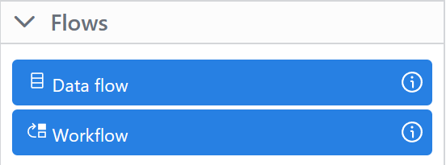

# Toolbox Flows tab

The Toolbox Flows tab allows you to add new [Dataflows](../data-flow-components/index.md) and [Workflows](../workflow-components/index.md). The tab is available after version 0.5.x.

To add a new dataflow or workflow, click on the corresponding icon and drag it to the top area of the application window. A new workflow or dataflow will then appear, which can be configured as described in the new [Dataflows](../data-flow-components/index.md) and [Workflows](../workflow-components/index.md).

