# Tutorial №1

 

## Creating Your First Application — Invoice Inventory

 

**Application Description: Invoice Inventory**

We are going to create a simple application that allows you to add, view, and edit invoices.

Each invoice will contain the following data (see the table below).

| Brief Description    | Detailed Description                                         |
| -------------------- | ------------------------------------------------------------ |
| Invoice Number       | Number assigned to the invoice by the supplier.              |
| Invoice Title        | Description of the invoice item.                             |
| Total Invoice Amount | Number indicating the amount of money billed in the invoice. |
| Invoice Due Date     | Date when the invoice is due for payment.                    |

 

Additionally, we will track the invoice status as follows (see the table below).

| ID  | Readable Title       | Description                                                                          |
| --- | -------------------- | ------------------------------------------------------------------------------------ |
| 0   | Under Review         | Assigned immediately upon invoice creation.                                          |
| 1   | Accepted for Payment | Assigned after the invoice review and approval for payment.                          |
| 2   | Rejected             | Assigned after the review is completed, but the invoice is not accepted for payment. |
| 3   | Paid                 | Assigned after the invoice is paid.                                                  |
| 4   | Overdue              | Indicates that the invoice is unpaid and the due date has passed.                    |

 

The basic version of the application will have 2 main screens.

- A list of all invoices in the system, which can be filtered and/or sorted using all the invoice fields described above. We will call it “All Invoices”.
- A screen for adding a new or editing an existing invoice. We will call it “Edit/View Invoice”.

After creation, the application will look like the screenshot below.

 

 

## Opening Studio

Creating an application on the platform starts with opening Studio and adding a component.

You can open Studio using the link https://<your_hosting_name>/studio/.

For example, if the domain name where you deployed your instance of the platform is [my.platform.io](http://my.platform.io/), you can access Studio using the following URL: “[https://my.platform.io/studio/”](https://my.platform.io/studio/%E2%80%9D).

After logging into Studio, you will see the following screen with a menu on the left listing Home, Applications & Access. Select Applications→Components.

 

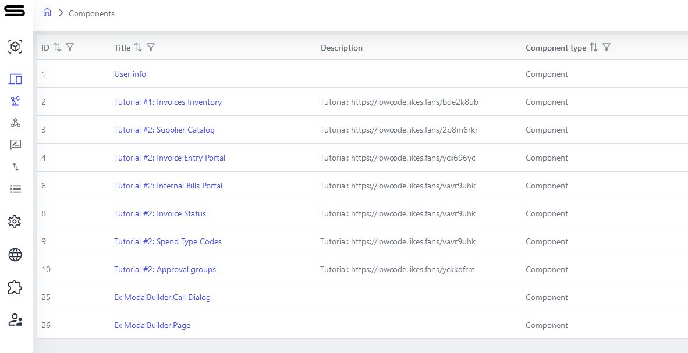

 

You will see a list of all existing components. Click the “Add” button and select the “Component” option, as shown below.

 

 

Congratulations, you now have your first component! Let's name it “Invoice Inventory” and set some important parameters.

To name your component, click the “Settings” button and then put “Invoice Inventory” in the “Name” field.

Since our application will only be accessible to people with the appropriate login credentials, we need to ensure that the “Access Mode” field is set to “Private”.

## Setting Up Required Data Fields

Click Save to make sure your component is saved. It will show an error message because we don't have any data in our component yet. Let's add some data.
Go to the "Definition" tab and click the "+" sign next to "Invoice Inventory". The platform will automatically add several system fields that you see in the screenshot, as well as your first data field — Property_1.

 

 

Click the edit icon (pencil) on Property_1. You will see a new panel open on the right. This is where you define how your data fields should be interpreted by the system.

Name — this is the internal system name for your data field (property). It should contain only English letters, without spaces. You will use this name later, for example, in Python scripts to add some advanced logic to the application.

_Note: starting with version 0.4.x, there is also a system property “name” that is automatically added when the first property is created and is used when you need to show users values for users when using properties of the Catalog type (link to another component; used for 1:1 and M:1 relationships) or Array (link to an array of other components; used for 1:M and M:M relationships). Unlike the internal system Name which is present for each property within the component, the system field name is one for the entire component._

Title — this is how your data field will be named in the user interface. Here you can use any characters you need.

For data fields that must always be non-empty, make sure the “Required” checkbox is selected.

The Property Type allows you to select one of the available data field types.

To start, we will add the data field Invoice Name, and set the property type to String. Since invoice names theoretically come from external suppliers, they may repeat, so we do not set the Primary Key flag here.

 

 

Once we have finished setting up our first field, let’s click Save.

Now let’s add the other fields we will need in our application: invoice number, invoice due date, total invoice amount, and invoice status.

**Invoice Number** is the internal account number of each unique invoice, which generally matches the invoice name, but we will ensure it is at least 2 characters long by setting the Min length value to 2, as shown below. It must also be unique to distinguish different invoices, even if they have the same names, so we set the Primary Key flag. This tells the platform that there cannot be more than one Invoice Number property with the same value. If an attempt is made to create a duplicate value, the system will give an error.

 

 

For the expected invoice due date, set the Property type to DateTime.

 

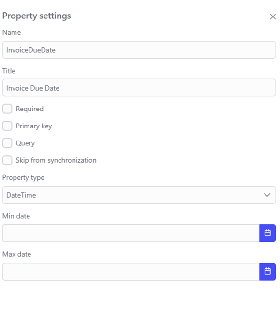

 

The total invoice amount should be set as a number. We will also set the Minimal value field to 0 to ensure there are no negative invoices (this might be different in a real financial application where negative values are used, for example, to represent credits from suppliers).

 

 

Finally, we will add the “Invoice Status” field. As stated in the application description, this will be a set of statuses that should look as follows:

0|Under Review
1|Accepted for Payment
2|Rejected
3|Paid
4|Overdue

For this, we need to set the property type to Integer (from version 0.5.24 and above) and check the Enum checkbox. Then we need to add all available statuses in the format <Number>|<Name>, as shown below.

 

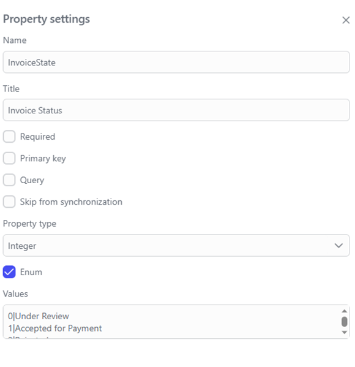

 

Click “Save”. You should see the fully configured data model, as shown below.

 

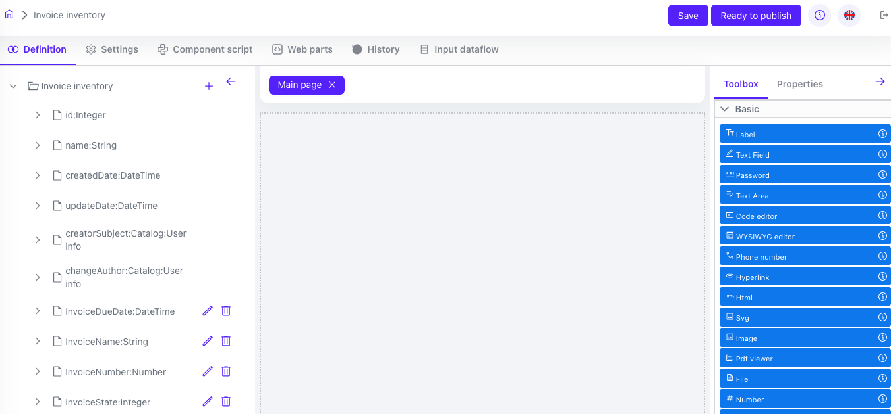

 

## Setting Up the Interface for Our Application

Now we need to set up the user interface for our application. As described above, we will need 2 screens:

1. A screen for adding a new or editing an existing invoice. We will call it “Add/View Invoice”.
2. A list of all invoices in the system, which can be filtered and/or sorted using all the invoice fields described above. We will call it “All Invoices”.

## Setting Up the Add/View Invoice Page

We already have an automatically added default page called “Main Page” above.

In the current version of the platform, the first page of the component by default is used as a form for viewing and editing component data when there is no explicit form for viewing and editing. For example, in our case, the Data Grid UI control that we will use for the All Invoices page will by default open the first page of our component.

We will also use the first page for the form for viewing and editing our invoice, and for this we will rename it from Main Page to Add/View Invoices. To do this, click on Main Page, and change the name in the dialog that opens (fields Name and Title).

The result will look as shown below.

 

 

Next, to create the data view and edit form, drag the data fields (properties) from the left into the middle area in the same order as in the data grid shown above.

The results should look like this.

 

 

Click the Save button. Now let's add a page for viewing all invoices.

## Setting Up the All Invoices Page

To do this, open the UI Components in the right panel, select Layout, click Page, and drag it into the middle area just above our invoice view form. A page named New page 1 should be added automatically, as shown below.

 

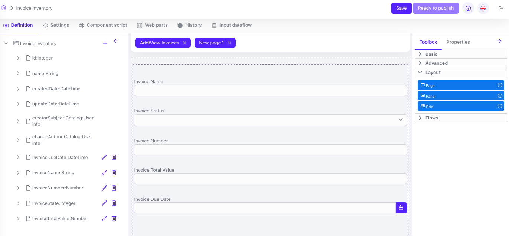

 

Go to the New page 1 by clicking the button with the same name, and rename it to All Invoices.

Click Save. In the UI Components list on the right, select Layout, then select Page and drag it into the middle area. Then go to the Advanced section and drag the DataGrid element into the newly created panel. You will see the result as shown below.

 

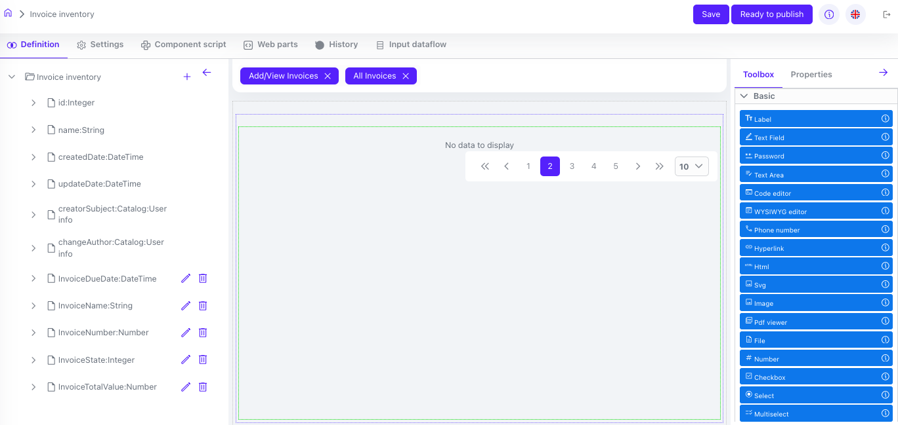

 

Click the Settings icon (gear) in the upper right corner of the new DataGrid element and select Common on the right panel. You will see the selection of the component to display data in this data grid. Select Invoice Inventory.

 

 

Then select the “+” icon next to the “Columns” label 5 times (since we have 5 data fields that we want to display here).

 

 

Now for each column, click on the column area. A new dialog will appear to configure the column.

For each column, you will need to set the header with the column name (e.g., “Invoice Number,” “Invoice Name,” etc.).

You also need to set the “Show Header” option to “On.”

If the “Sortable” and/or “Filterable” options are set to “On,” you will enable dynamic sorting and filtering (similar to how it is done in Excel, for example).

Finally, you need to click the “Add field” button and select the appropriate data field to display in this column.

The example below shows the setup for the “Invoice Number” field. The other columns are set up similarly.

 

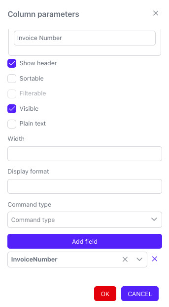

 

After you have set up all the columns, go to Actions on the form on the right and make sure the “Show add button” is selected. This will allow adding new invoices through this DataGrid.

Additionally, set the Command Type to “Edit Record” so we can view/edit any invoice in the list by clicking on it.

See the illustration below for the results.

 

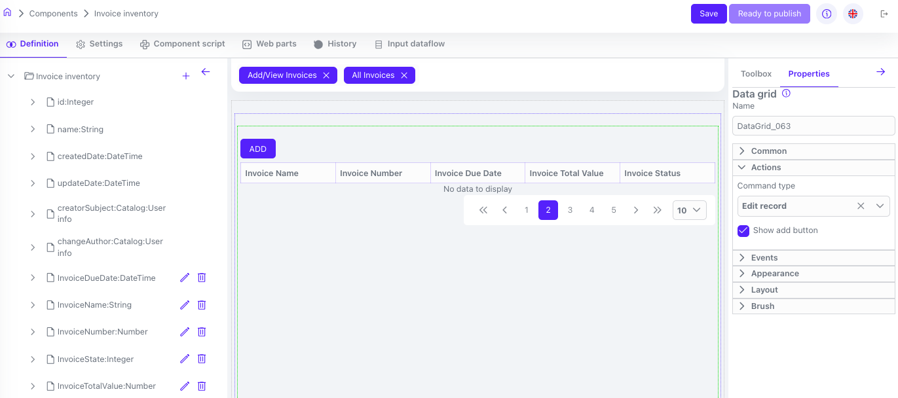

 

Click the Save button.

## Adding Action Buttons and Dataflow for Saving Data

After we have created the data view and edit forms, we need to add logic to save the form data to the database and allow users to trigger it.

To do this, we need to do two things.

1. Add buttons that we will use either to save the form data or to cancel all changes and return to the All Invoices list.
2. To save the form data, we will add a simple workflow that will take the form data and save it to the database.

 

## Add Save and Return to all invoices buttons

 

Click “Toolbox”, select the “Button” field in the “Basic” section, and drag the button to the middle area of the screen. Set the button title to Save. To do this, go to the Common section, and in the Translation Value field, write Save.

Add another button and set the title to “Back to all invoices.” The result should look like the picture below.

 

 

Now we will make the “Back to all invoices” button switch the UI to the main “All Invoices” tab. To do this, in the Settings menu for the bottom button, select “Actions” and set the “Command Type” to “Open Page” and the “Component Page” to “All Invoices.” Click Save.

 

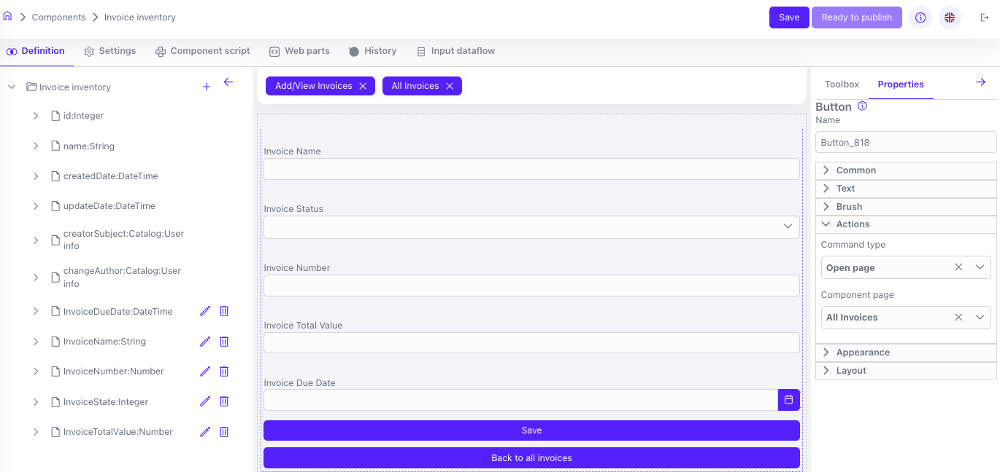

 

## Adding Data Flow for Saving

To make the Save button in the application save the entered data as an invoice, we need to add a data flow.

Click “Toolbox”, select the “Data flow” field in the “Flow” section, and drag it to the middle area of the screen. A new data flow with the default name “Data flow 1” will appear, accessible via the button with the same name in the main component settings menu, to the right of the Input Data flow button. Click the Data flow 1 button and rename your data flow to Save.

The result should look like this.

 

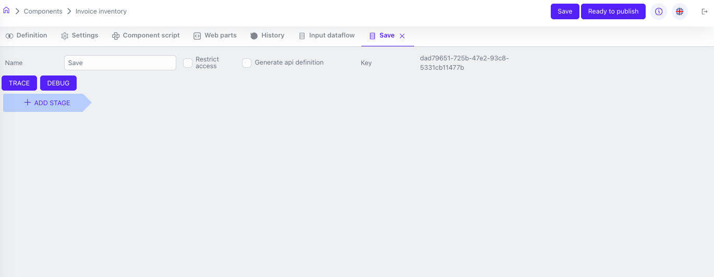

 

Next, click the "+ ADD STAGE" button, then "Add step" and select the "Get action model" step. Add another step and select "Update entry", then go to the settings for this step. You can read more about this step in the "Dataflow" section. Configure the step as shown below:

 

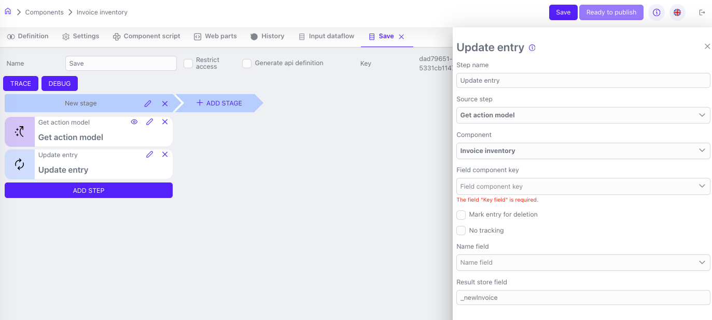

 

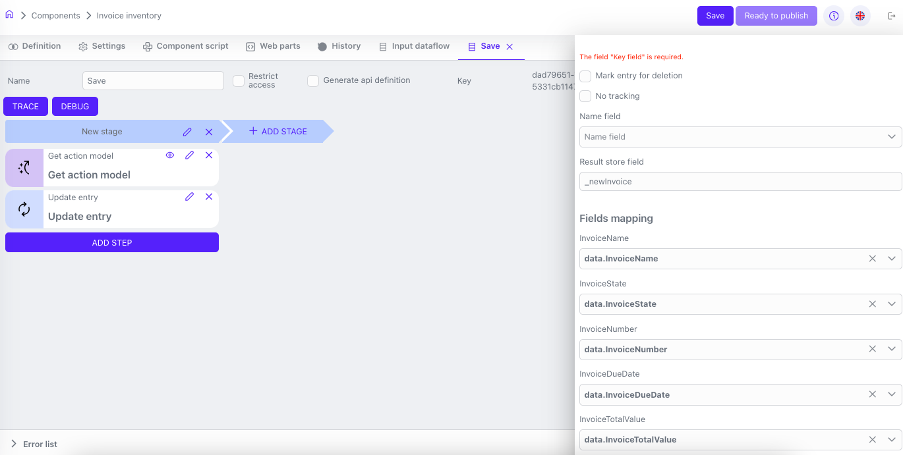

 

Next, add the "Write response" step, specify the source step in its settings, and save the component.

After that, in the Settings menu for the Save button, select Actions and set the Command Type to Execute dataflow, and choose your new Save from the list.

Click the Save button. The result should look like this.

 

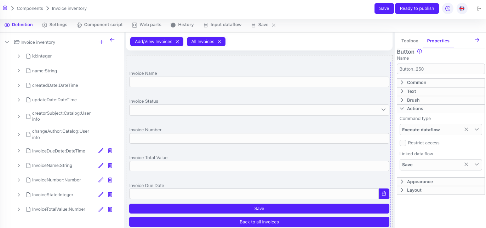

 
 
Click Save and Ready to publish. Your new component is created and ready to be published.

 

## Publishing and Testing Your Application

You are now ready to publish and test your application.

To publish your application, click the Ready to publish button inside your component, then go to Studio→Applications→Publication. Select your Invoice Inventory component from the list of components available for publication, and click the Publish button.

You can then use the View App button inside your Studio (not always available), or go to the URL <your-host-name> to see your application in action.

Fill in the invoice details and click Save. Then click the “Back to all invoices” button. Your first invoice will be saved, and you will see the list of all available invoices.
