# Tutorial №2 
<br>

## Creating a Simple Application for a Car Dealership
<br>

**Application Description:**

We are going to create an application consisting of several components that allows tracking cars available for sale, assigning a manager for contract signing, and enabling managers to close the deal.

**We will create the following components:**

<br>

### Component "Transaction Specialists"

The first component will be a simple form for adding new managers and will consist of a single custom property:

<br>


<br>

Next, we move on to setting up our workspace, adding a panel element where we will conduct our work. 

Then, in the panel settings under the "Layout" settings group, change the panel orientation to vertical and start adding the following elements: we will need the manager_name we created and a button. It should look like this:

<br>

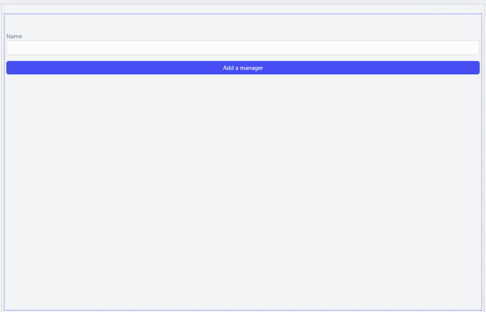

<br>

Next, create a dataflow, name it "Add a manager" and add the following steps: `get action model`, `update entry`, `write response`. It should look like this:

<br>


<br>

Configure the `Update entry` step as follows:

<br>


<br>

**Don't forget** to set the `source step` for the `update entry` step!

After setting up the dataflow, link it to the button as follows: go to the button settings, click on the "actions" settings group, set the "command type" to "execute dataflow" and select the dataflow we created "Add a manager".

Click on "Save", "Ready to publish". Publish the component, then add it to the workplace using the "Navigation menu" of the domain where you are deploying your application (in our case, this is the "digital-workplace" domain).

<br>

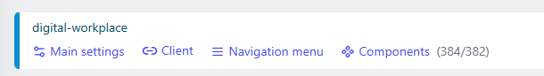

<br>

Click "ADD MENU ITEM" and add our component:
<br>

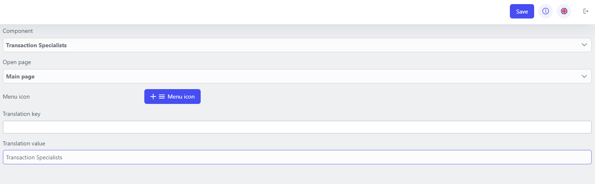

<br>

Go to the `workplace` and add a few managers for further work with them.

<br>

### Component "Car fleet"

<br>

With this component, we will set up the display of all cars and general information about them, add a form for creating records of new cars, a form for assigning a transaction manager to a car, and a form for confirming that the deal is completed with subsequent archiving of the car record. 

In this component, we will create a number of custom properties:

- `car_vin`: property type - `string`, title - `VIN`, settings - `required`, `primary key`, `query`;
- `car_brand`: property type - `string`, title - `Car Brand`, settings - `required`, `query`;
- `car_model`: property type - `string`, title - `Car Model`, settings - `required`, `query`;
- `year_of_manufacture`: property type - `integer`, title - `Year of manufacture`, settings - `required`, `query`;
- `color`: property type - `string`, title - `Color`, settings - `required`, `query`;
- `price`: property type - `number`, title - `Price of the car`, settings - `required`, `query`;
- `is_manager_exists`: property type - `boolean`, title - `Is manager exists`, settings - `query`;
- `choosen_manager`: property type - `catalog`, component - `Transaction Specialists` title - `Chosen Manager`, settings - `query`;
- `is_archieved`: property type - `string`, settings - `query`.

The component will consist of the following parts (pages):

<br>

1. **Main page**

To add a page, you need to find the `Layout` group in the `Toolbox` and drag the `Page` element into the workspace.

This page will present a data grid with all cars available for sale and general information about them for sales managers. In addition, we will add a button to the page that will redirect to a form for adding cars to the list, but we will add it later.

Add a panel to the workspace, change the orientation setting to vertical, then add two more panels. In the lower panel, place the data grid element, and in the upper panel, add two more panels. In the left panel, place a label and write "Car fleet" in its "translation value" settings. In the right panel, add a button and write "Add a new car" in its "translation value". Later we will change the "Actions" setting, but for now, you can change the button size in the "Layout" settings.

<br>

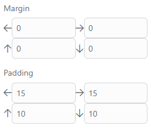

<br>

You can try other settings. 

Next, proceed to configure the `data grid`: click on the gear icon and select the component for the data grid "Car fleet". Then next to columns, click on `+`, this will add a column to our data grid, do this 5 times. 

Click on the first column, then "Add field" and select the property `car_brand`. The further configuration should look like this:

<br>


<br>

You should configure the following columns in a similar manner in this order: 2nd column - `car_model`, 3rd column - `year_of_manufacture`, 4th column - `color`, 5th column - `price`.

Also, in the data grid settings, set `Static filters`. Since we are going to display cars that have not yet been assigned a manager, set the following setting:

<br>


<br>

The final result in our workspace should look like this:

<br>

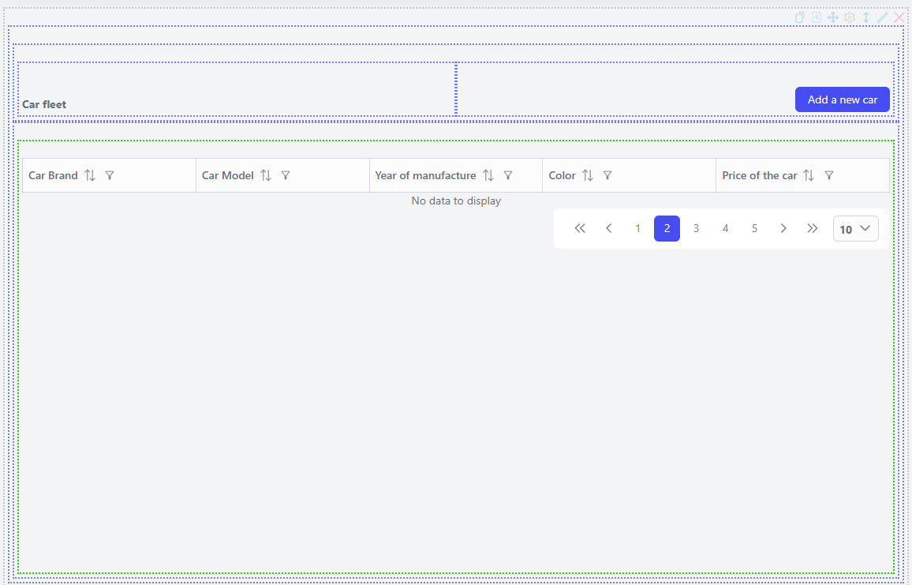

<br>

2. **Add a new car**

This page will be accessed by the user clicking the "Add a new car" button from our previous page. Let's start setting up our workspace.

Add a panel to the page. In its settings, change the page orientation to vertical. Next, add two more panels. In the first panel, also change the orientation to vertical and transfer our properties to look like this: 

<br>


<br>

In the lower panel, add two buttons, set their padding as on the "Add a new car" button and name them accordingly: "Add a new car" and "Back to all cars". 

In the settings for the "Back to all cars" button, set the "Actions" to "Open page" "Main page". Clicking this button will redirect the user to the page with the data grid. For the "Add a new car" button, create a data flow, which we will link to it later.

The data flow will consist of the following steps: `get action model`, `execute script`, `update entry`, `write response`. Let's configure them. 

In the `execute script` step, create variables that will be used for the properties `is_manager_exists` and `is_archieved`:

```
item["_is_manager_exists@boolean"] = False
item["_is_archieved@boolean"] = False
```

Next, configure the `Update entry` step:

<br>

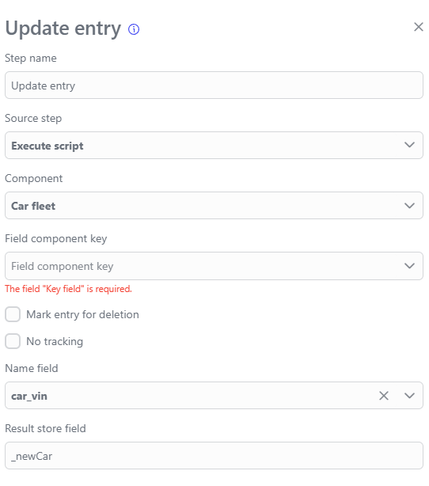

<br>

Next, we need to map our fields. **Remember** that the fields in the step settings are mapped with the prefix data.`property_name`. For the properties `is_archieved` and `is_manager_exists`, use the variable values set in the execute script step, leave the `chosen_manager` field empty:

<br>

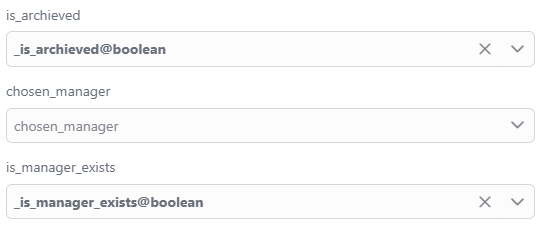

<br>

**Always set the source step for each step except the first one. This will not be mentioned further in the tutorial description.**

Now that our data flow is complete, we can link it to the "Add a new car" button and save our component. The final result of our page is shown below: 

<br>


<br>

3. **Appoint a manager**

This page will be called as a modal window when clicking on a particular entry in the data grid. It is designed for a single function - assigning a manager to a particular car. Let's move on to setting up the workspace.

The page itself will resemble the "Add a new car" page, with the only difference being that we will add the `chosen_manager` property to the workspace, which will be the only property available for modification. This allows the manager to select a colleague to whom they will transfer the car and the deal. Also, add two buttons, one to close the modal window called "Back to all cars", and the other called "Appoint a manager" which will be linked to a data flow that we will create later.

**Don't forget to enable the Disabled setting in the TextBox settings for each property except `chosen_manager`.**

<br>


<br>

The final result on this page should look like the one shown below:

<br>

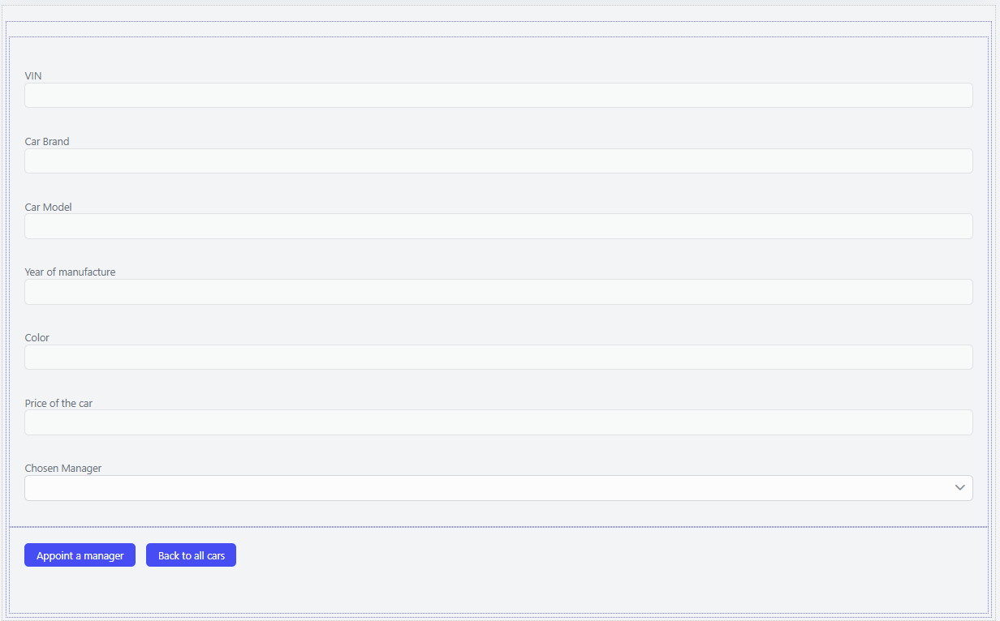

<br>

**Let's move on to configuring the data flow**. 

We need to add the following steps: `get action model`, `execute script`, `lookup reference`, `update entry`, `write response`. 

In the `execute script` step, we will create a variable that will change the `is_manager_exists` property to True, causing the newly created entry to disappear from the data grid on the Main page, where we have set static filters. 

```
item["_is_manager_exists@boolean"] = True
```

Next, we use the `Lookup reference` step. I recommend you read about this step in the Dataflow section of our technical documentation. The step should be configured as shown below.

<br>

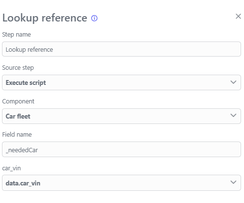

<br>

Next, we configure the `Update entry` step, in the field component key specify the field name from the `Lookup reference` step:

<br>


<br>

In 'Fields mapping' leave the fields empty except for `chosen_manager` and `is_manager_exists`, these are the fields we want to change in the record found using the `Lookup reference` step.

<br>

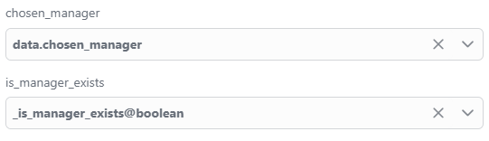

<br>

In the `write response` step, we need to set the source step. 

Assign this dataflow to be executed when the "Appoint a manager" button is pressed. Then save the component.

<br>

**Proceed to the component script for building the modal window**.

To create a modal window, you can use the script below. For working with the **component script** I highly recommend you read the documentation section `Using Python`:

```
def show_model_info(model):
    context.Logger.Error("updated")

def open_custom_modal(sender, model):
    # Creating a modal window template using the GUID of a specific component
    dialog_builder = context.PlatformServices.DialogBuilder('component guid')
    # Setting the title for the modal window and selecting a specific page from the component's settings
    # Also setting the component instance ID to 1, so the first saved instance of component data will be used
    dialog_builder.WithEntryId(int(model[0].Id)).WithTitle("Appoint a manager").WithPageId('page id')
    # Setting the size of the modal window
    dialog_builder.WithVSize("650px").WithHSize("820px")
    dialog_builder.OnComplete(lambda model: show_model_info(model))
    dialog_builder.OnCancel(update_cars_success)
    # Opening the created modal window
    dialog_builder.OpenDialog()
    
def get_datagrid_cars(sender, *args):
    global datagrid_cars
    datagrid_cars = sender
    
def update_cars_success():
    datagrid_cars.Refresh()
```

The `get_datagrid_cars` and `update_cars_success` functions are used to automatically update the data grid after some action. If you don't use them, the data grid will only update after refreshing the page in the browser. After copying, you need to save the component and return to the workspace on the "Main page".

You need to go to the data grid settings in the `Events` settings group, and assign the execution of functions to certain actions on the data grid.

<br>


<br>

Save the component, then proceed to setting up the next page.

4. **Enter into a contract**

This page is a form that allows the manager to archive a particular car deal by changing the `is_archieved` field to `True`.

The page is a copy of the `Appoint a manager` page, the only difference being that all fields have the `Disabled` -> `True` setting. At the bottom, we will add two buttons, one of which will launch the dataflow, and the other will redirect the user to the component page that we haven't created yet.

The page itself should look like this:

<br>

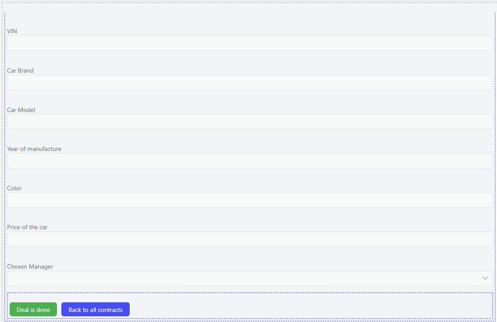

<br>

Let's move on to creating and configuring the dataflow. We will need 5 steps: `get action model`, `execute script`, `update entry`, `form action`, `write response`. 

In the `execute script` step, we will create a variable that will set the value `True` in the `is_archieved` property. 

```
item["_is_archieved@boolean"] = True
```

The configuration of the `update entry` step should look like this:

<br>

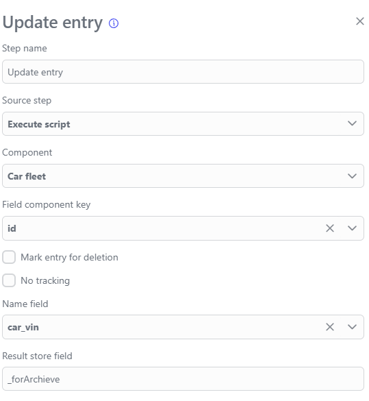

<br>

In the field component key, we will provide a reference to the record we want to edit, then proceed to "Fields mapping". Here we leave all fields empty except for `is_archieved`. Here we put the variable we set in the `execute script` step.

Next is the `Form action` step, which we will return to after creating the final component. For now, save the component to avoid losing your work.

### Component "Managers grid"

This component will consist of a single page and we will not create custom properties for it. This component will only be used by managers who have access to it, allowing them to see all cars that have been moved to the deal stage and assigned to a particular manager. 

Create a data grid, link it to the `Car fleet` component, and add a column for each of its properties. The result should look like this: 

<br>


<br>

Then go to the `Actions` settings group, set Command type to `Open application`, Component to `Car fleet`, Component page to `Enter into a contract`, a page we created as the last page of the `Car fleet` component. 

Next, click on the `Action parameters` button and map Id -> Id as shown below.

<br>


<br>

Let's save the component and go to its settings. Besides naming and selecting the required domain, we need to check the `Restrict access` box so we can set special security permissions for this component. 

Let's save again, mark the component as ready to publish, and add it to the `Navigation menu` of the domain we are using. 

<br>

**Return to the `Car fleet` component on the `Enter into a contract` page**

There is one unused button left, `Back to all contracts`, let's set its `Command type` in the `Actions` settings group to `Navigation back`.

Next, we need to return to the "Deal is done" dataflow and finish configuring the `Form action` step. The final configuration of the step should look like this:

<br>

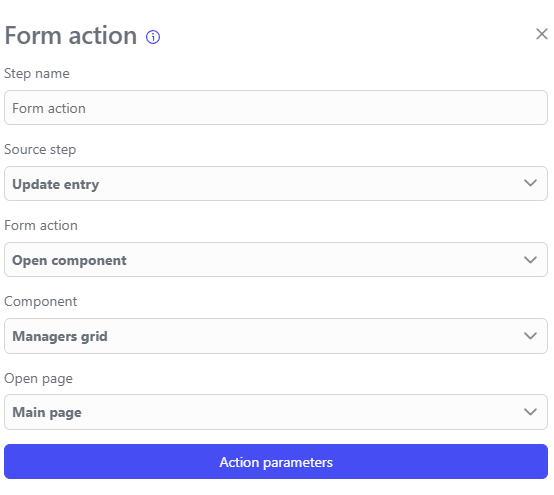

<br>

**Don't forget to select the `source step` in the `update entry` step**.

Save, publish the component, add it to the workplace using the `Navigation menu` and ensure that all components are in place. 

<br>

### Setting access to the `Managers grid` component

You need to go to the "Access" menu in the "Permissions" section and click the "Add" button in the top right corner. 

A permission settings window will open on your screen, where you need to specify the domain and give a name for the permission. To grant access to manipulate the `Managers grid` component, go to `Permissions`, enter the `Components` section, find our `Managers grid` component, and select full access rights for it. Click the "Save" button and proceed to the next section "Roles".

Here you also need to click the "ADD" button, select the required domain, name it, and select the "Permission" you created earlier. Then proceed to the `Users` section.

In the `Users` section, all users registered in your system are listed. Click on the user to whom you want to grant rights to use this component, in "Select contexts" choose "Platform" -> "System" and in "Select roles" find the role you created earlier, then click the checkbox and click "Save".

<br>

### Conclusion

You have created a small and simple application in which you worked with several components and learned how to link them together. You learned how to create modal windows and began to explore the interaction between programming languages and our platform's tools.

Try to create several managers, add new cars for sale, assign managers to them, and attempt to close deals. 

Of course, this application is a test; it can be improved and made more complex endlessly. After creating it, you can use other tools on your own, build different logic, and customize the design to your liking. The platform provides you with flexible tools that make development more exciting and easier! 

Descriptions of the tools used in the tutorial can be found in the "Application Development" section.